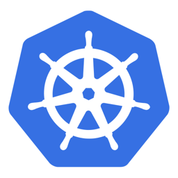
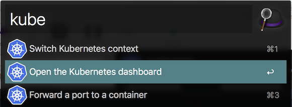
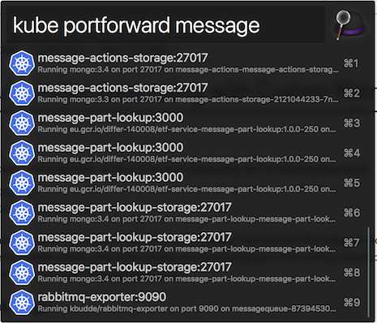
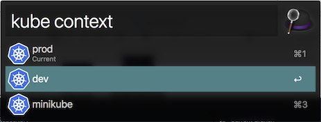

#  alfred-kubernetes [](https://circleci.com/gh/kennethlynne/alfred-kubernetes/tree/master) [](https://badge.fury.io/js/alfred-kubernetes) [](https://github.com/kennethlynne/alfred-kubernetes/blob/master/license) [](https://github.com/semantic-release/semantic-release)

> Alfred workflow to manage a Kubernetes cluster


## Install

```
$ npm i -g alfred-kubernetes
```

*Requirements:*
 * [Node.js](https://nodejs.org) 7+
 * Alfred [Powerpack](https://www.alfredapp.com/powerpack/)
 * Kubernetes is already installed and configured (uses kubectl behind the scenes)

## Features

__kube__: List of available commands



__kube portforward__ *[name of pod]* *[port]*: List containers that expose a port and forward it



__kube ui__: Will run kubectl proxy and open the dashboard in the default browser

__kube context__ *[name]*: List available contexts and let you switch between them



## License

MIT © [Kenneth Lynne](http://kenneth.ly)
