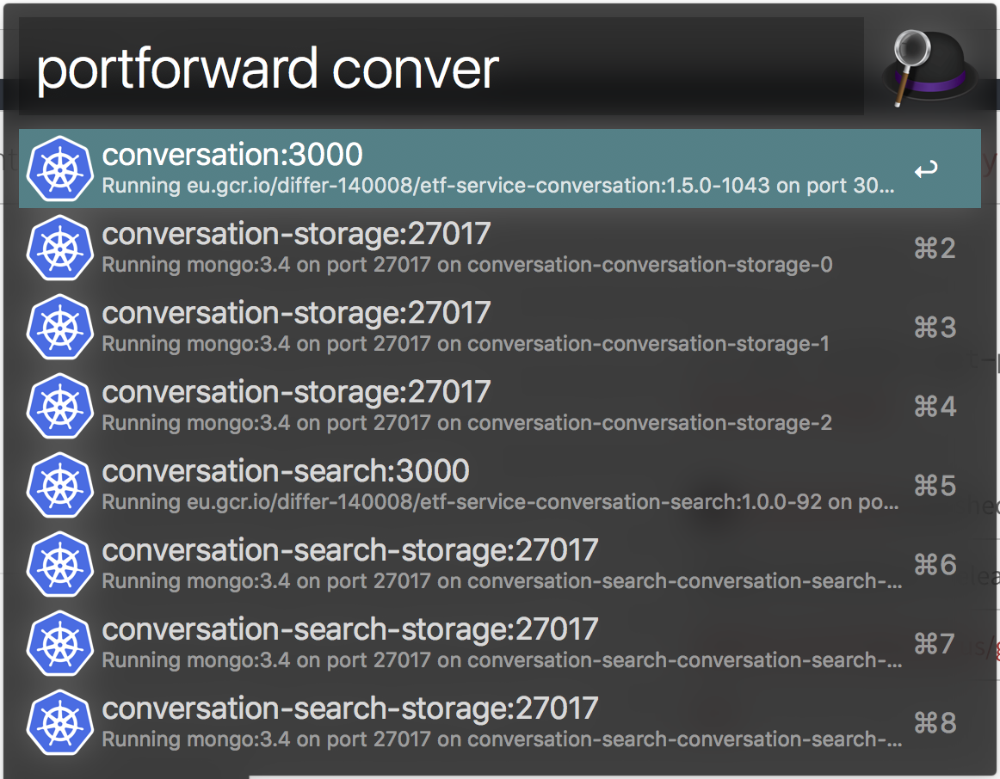
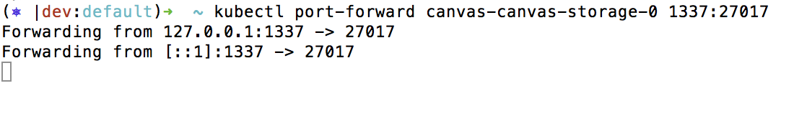
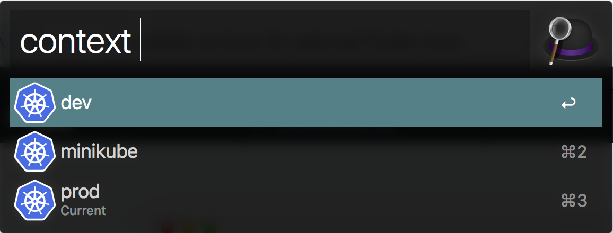

# alfred-kubernetes [](https://circleci.com/gh/kennethlynne/alfred-kubernetes/tree/master)

> Alfred workflow to manage a kubernetes cluster


## Install

```
$ npm i -g alfred-kubernetes
```

*Requirements:*
 * [Node.js](https://nodejs.org) 7+
 * Alfred [Powerpack](https://www.alfredapp.com/powerpack/)
 * Kubernetes is already installed and configured (uses kubectl behind the scenes)

## Features

__portforward__ *[name of pod]* *[port]*: List containers that expose a port and forward it





__kubernetes ui__: Will run kubectl proxy and open the dashboard in the default browser

__context__ *[name]*: List available contexts and let you switch between them



## License

MIT © [Kenneth Lynne](http://kenneth.ly)
